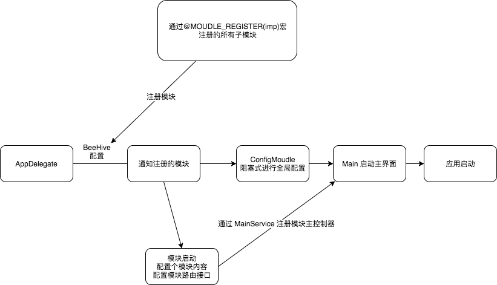

# MLSProject
[](LICENSE)
[](https://github.com/MinLison/MLSProject/pulls)
[](https://github.com/MinLison/MLSProject)
[](https://github.com/MinLison/MLSProject)


## 欢迎各位 fork 后指正不足之处
## 项目暂时略有瑕疵，如有适配问题，可 Fork 后 Pull request，小弟会一一解答
## 前言

　　`MLSProject` 项目是一个 iOS App 开发架构，结合目前优秀的三方框架，旨在快速构建 App。目前对纯代码开发支持良好，对 xib 以及 storyboard 支持暂不友好。

## 项目介绍

　　打造一个快速开发 App 的通配性框架，经过少量修改即可适配多种后台模式，快速搭建 UI，对网络模块进行自定义缓存配置。对每个请求可自由操作，对类似 form 表单界面进行精确控制。
　　
## 组织结构
```
MLSProject
├── AppDelegate -- 继承 BHAppDelegate ， app 启动配置 BHAppDelegate，模块内配置各自的启动操作。
├── MemoryCheck -- facebook/FBMemoryProfiler, 可选内存检测，通过配置 FBMemoryProfiler 宏控制
├── Router -- 路由接口配置. url scheme 是 [mls]
├── Animations -- 全局转场动画配置
├── ThirdCode -- 修改过源码的三方库
├── ThirdLib -- 三方库 framework/lib
├── ThirdUI -- 三方UI模板[QMUIKit]
├── Unit -- 工具类
├── Categories -- 分类
├── Resource -- 资源
├── Moudles -- 模块
|    ├── Base -- 基类 
|    ├── Update -- App升级模块
|    ├── Main -- App 主页面模块 [UITabBarController/IIViewDeckController]
|    ├── Comment -- 用户评论模块
|    ├── Mine -- 个人中心模块
|    ├── User --  用户管理模块，注册，登录，以及跟用户相关的内容
|    ├── Common --  公用模块
|    └── Config -- 项目配置模块

```
#### 架构图


## 技术选型

#### 架构
技术 | 名称介绍 | 官网
----| ---- |----|
BeeHive | 模块化编程 | <https://github.com/alibaba/BeeHive>
JLRoutes | 路由[模块解耦] | <https://github.com/joeldev/JLRoutes>


#### 网络
技术 | 名称介绍 | 官网
----| ---- |----|
YTKNetwork | 网络框架 | <https://github.com/yuantiku/YTKNetwork>
HLNetWorkReachability | 网络状态检测 | <https://github.com/Haley-Wong/HLNetWorkReachability>

#### 调试
技术 | 名称介绍 | 官网
----| ---- |----|
FBMemoryProfiler | 内存检测 | <https://github.com/facebook/FBMemoryProfiler>
Reveal-SDK | 界面调试 | <https://revealapp.com/>

#### 工具
技术 | 名称介绍 | 官网
----| ---- |----|
WZProtocolInterceptor | 协议拦截 | <https://github.com/haifengkao/WZProtocolInterceptor>
KVOController | 属性监听 |<https://github.com/facebook/KVOController>
Aspects| AOP切面编程 |<https://github.com/steipete/Aspects>
SAMKeychain | 钥匙串 | <https://github.com/soffes/SAMKeychain>
CocoaLumberjack | 日志工具 | <https://github.com/CocoaLumberjack/CocoaLumberjack>
<del>FormatterKit</del> | <del>格式化字符串(未使用)</del>| <del><https://github.com/mattt/FormatterKit></del>
<del>WebViewJavascriptBridge </del>| <del>JS 交互(未使用)</del>| <del><https://github.com/marcuswestin/WebViewJavascriptBridge></del>

#### UI
技术 | 名称介绍 | 官网
----| ---- |----|
QMUIKit | UI 框架 | 　<https://github.com/QMUI/QMUI_iOS>
YYKit | 模块框架 | <https://github.com/ibireme/YYKit>
pop | 动画 | <https://github.com/facebook/pop>
IQKeyboardManager | 键盘通知管理 | <https://github.com/hackiftekhar/IQKeyboardManager>
Masonry | 自动布局 | <https://github.com/SnapKit/Masonry>
SDWebImage | 图片加载 | <https://github.com/rs/SDWebImage>
VCTransitionsLibrary| 转场动画 |<https://github.com/ColinEberhardt/VCTransitionsLibrary>
ViewDeck| 侧边栏 |<https://github.com/ViewDeck/ViewDeck>
PYSearch | 搜索 | <https://github.com/ko1o/PYSearch>
PKYStepper | UIStepper 替换 | <https://github.com/parakeety/PKYStepper>
MLSExcelView | excel 表格工具 | <https://github.com/Minlison/MLSExcelView>
XLForm | Form 表单提交 | <https://github.com/xmartlabs/XLForm>>
UINavigation-SXFixSpace | 全局导航栏 item 间距控制 | <https://github.com/spicyShrimp/UINavigation-SXFixSpace
WZLBadge | 角标 | <https://github.com/weng1250/WZLBadge>
FDStackView | UIStackView 低版本适配 | <https://github.com/forkingdog/FDStackView>
MJRefresh | 刷新控件 | <https://github.com/CoderMJLee/MJRefresh>
UITableView-FDTemplateLayoutCell | 自动行高计算 | <https://github.com/forkingdog/UITableView-FDTemplateLayoutCell>
HMSegmentedControl | UISegmentedControl  | <https://github.com/HeshamMegid/HMSegmentedControl>
WMPageController | UIPageViewController | <https://github.com/wangmchn/WMPageController>
US2FormValidator | 表单校验 | <https://github.com/ustwo/US2FormValidator>
DZNEmptyDataSet | ScrollView 空视图 | <https://github.com/dzenbot/DZNEmptyDataSet>
DZNPhotoPickerController | 照片选择器 | <https://github.com/dzenbot/DZNPhotoPickerController>
FSMediaPicker | 照片选择器 | <https://github.com/WenchaoD/FSMediaPicker>
libPhoneNumber-iOS | 手机号校验 | <https://github.com/iziz/libPhoneNumber-iOS>
FXForms | 表单 | <https://github.com/nicklockwood/FXForms>
MZTimerLabel | 倒计时 | <https://github.com/mineschan/MZTimerLabel>
STPopup | 弹出控制器 | <https://github.com/kevin0571/STPopup>
Nimbus | TableView/CollectionView 表格 | <https://github.com/jverkoey/nimbus>
FDFullscreenPopGesture | 全局返回手势 | <https://github.com/forkingdog/FDFullscreenPopGesture>
ObjectiveSugar | 分类 | <https://github.com/supermarin/ObjectiveSugar>
SDPhotoBrowser | 图片浏览器 | <https://github.com/gsdios/SDPhotoBrowser>
DurexKit | 防止崩溃,捕捉bug并且不报错 | <https://github.com/zgGitHub/DurexKit-master>
extobjc | 宏定义 |<https://github.com/silence0201/extobjc>
IMYWebView | webView自动适配 | <https://github.com/li6185377/IMYWebView>
JKCategories | 工具 | <https://github.com/shaojiankui/JKCategories>
SDCycleScrollView | 轮播图 | <https://github.com/gsdios/SDCycleScrollView>
TTTAttributedLabel | 属性字符串展示 | <https://github.com/TTTAttributedLabel/TTTAttributedLabel>
CRToast | 导航栏提示 | <https://github.com/cruffenach/CRToast>
<del>EAIntroView</del> | <del>开屏引导图(未使用)</del> | <del><https://github.com/ealeksandrov/EAIntroView></del>
<del>NJKWebViewProgress</del> | <del>网页进度条(未使用)</del> | <del><https://github.com/ninjinkun/NJKWebViewProgress></del>
<del>Appirater</del> | <del>应用评分(未使用)</del>| <del><https://github.com/arashpayan/appirate>r</del>
<del>EBForeNotification </del> | <del>前台通知(未使用)</del>| <del><https://github.com/pikacode/EBForeNotification></del>
<del>lottie-ios</del>|<del>动画</del>|<del><https://github.com/airbnb/lottie-ios></del>
<del>ChameleonFramework</del>| <del>颜色库(未使用)</del> | <del><https://github.com/sanfreefeng/ChameleonFramework></del>
<del> FontAwesomeKit </del>| <del>字体库(未使用)</del> | <del><https://github.com/PrideChung/FontAwesomeKit></del>


#### 其它
技术 | 名称介绍 | 官网
----| ---- |----|
R.swift.OC | [R.swift](https://github.com/mac-cain13/R.swift) for OC | <https://github.com/Minlison/R.swift.OC>
appledoc | 注释文档生成工具 | <https://github.com/tomaz/appledoc>
fastlane | 自动打包 | <https://github.com/fastlane/fastlane>


## 环境搭建

#### 开发工具 
- Xcode9.2


## 框架规范约定


```
- Moudle 新建模块放在 Moudles 文件夹下， 每个 Moudle 文件夹可有 Models, Protocols，ControllerViews, ViewControllers, Controllers, Views, Requests, Services 子文件夹
- ViewController 类，需要在叫名 ViewControllers 的文件夹下，并以 ViewController 结尾，如 BaseViewController 
- ControllerView 类，需要在叫名 ControllerViews 的文件夹下，并以 ControllerView 结尾，如 BaseView ， ViewController 会自动按照规则[控制器视图的 View 默认是 把 **ViewController 去掉 Controller 的 Class 创建一个 View]
- Controller 类 ，需要在叫名 Controllers  的文件夹下，并以 Controller 结尾，如 BaseController 
- Request 类， ，需要在叫名 Requests  的文件夹下，并以 Request 结尾，如 BaseRequest
- View 类，需要在以 Views 的文件夹下
- 可自行定义规范

```

## 附件
### 在线小工具
- [在线工具 - 程序员的工具箱](http://tool.lu/ "在线工具 - 程序员的工具箱")

## 许可证

[MIT](LICENSE "MIT")